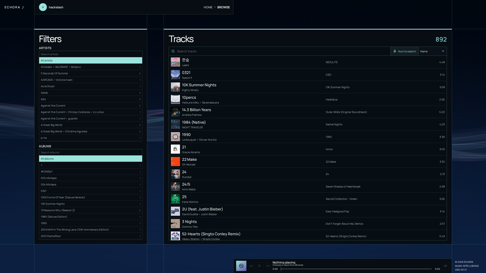
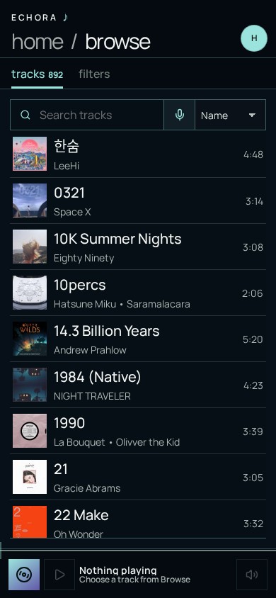

# Echora

**Rediscover the music you already own.**

Echora is a self-hosted music discovery and listening app for your [Navidrome](https://www.navidrome.org/) library. Browse your collection, explore connections between songs, and build playlists from the sound, lyrics, or listening habits you have in mind.

It sits alongside Navidrome rather than replacing it. Navidrome hosts your music; Echora analyzes it and gives you more ways to find something to play. You bring the tracks. There is no bundled music catalog or subscription recommendation service.

[Take a look](#take-a-look) · [What you can do](#what-you-can-do) · [Get started](#get-started) · [Development](#development)

## Take a look

### Desktop

[](docs/screenshots/desktop-browse.png)

Desktop capture at **2560 × 1440**. Click the image to open the full-resolution version.

### Mobile

[](docs/screenshots/mobile-browse.png)

Screenshots show a real example library for illustration. Visible account names, track titles, and artwork are not bundled demo content. Music and artwork belong to their respective rights holders; their appearance does not imply endorsement. Your library and analysis results will look different.

## What you can do

- **Browse and listen.** Search tracks, filter by artist or album, and keep playback running while moving between pages. Open the full player for artwork and available lyrics.
- **Explore the Galaxy.** See your collection as a map of related tracks. Switch between semantic, acoustic, and lyrical similarity, inspect concept associations, or build a sonic journey between two songs.
- **Build curations.** Combine sound tags, lyrical themes, language preferences, and songs you want more or less of. Preview the results, then save a recipe that manages a playlist in Navidrome.
- **Bring in listening history.** An optional Last.fm connection lets curations balance familiar tracks with discovery and use recurring listening periods, such as your evening listening habits.
- **Search by humming.** Record a short melody and search the indexed library. This is experimental and depends on the quality of both the recording and the extracted melody.
- **Follow the track.** Precomputed waveform bars show changes in audio energy. An optional melody line uses existing hum-search pitch contours. When source lyrics support it, karaoke processing adds syllable timing.

Echora supports multiple users. Each user signs in through your identity provider and connects their music library. Analysis can be reused for shared tracks, while user-library links control visibility.

## A few ways to use it

### Start with a small part of your library

Sign in, connect Navidrome, choose some tracks, and let the first analysis finish. Then open **Browse** to listen or **Galaxy** to explore. Starting small is a useful way to check your setup before processing a large collection.

Later, use **Sync → Entire Library** to fill in missing analysis across your catalog. **New Tracks Only** processes tracks that are not yet indexed. Successful artifacts are reused when their source and processing configuration still match; failed or outdated work can be retried.

### Turn an idea into a playlist

Open **Curate** and name your playlist. Add sound tags such as `guitars`, exclude sounds with `-synths`, describe lyrical themes, or choose example songs. You can also specify a language.

Use **Preview** to inspect and play the results. When you like the direction, choose **Save + Sync** to publish the playlist to Navidrome. Enable the 24-hour refresh schedule if you want Echora to keep updating it.

These are managed playlists. Refreshing a curation can replace its membership and order, so do not rely on manual edits to that playlist being preserved. Your source audio files are not rewritten.

### Explore without knowing what to search for

Open **Galaxy**, pick a track, and explore its connections. Semantic similarity follows broader musical characteristics; acoustic similarity focuses on the recording's sound. Lyrics provide another way to explore when they are available.

The map is a two-dimensional visualization, not a precise ruler. Rankings use the underlying representations rather than the distance between dots on screen.

## Before you install

The default Compose setup expects:

- Docker Engine with Docker Compose.
- An NVIDIA GPU, compatible drivers, and NVIDIA Container Toolkit. The default analysis image uses CUDA 13.0.
- A reachable Navidrome server and credentials for its Subsonic API.
- An OpenID Connect identity provider. Echora does not have local password login.
- Space for the database, analysis data, container images, and model downloads. Budget tens of gigabytes for models and images before allowing for your library's analysis data.

The first sync is compute-heavy, especially melody extraction and karaoke alignment. Processing time and GPU memory requirements vary with the library and enabled operations; there is no single verified minimum GPU specification yet. Administrators can disable karaoke and hum processing under **Settings → Models** without removing existing results.

A CPU analysis service is included under the `cpu` Compose profile, but the default web service still points to the GPU analysis service. It is not a drop-in CPU-only setup; that requires Compose overrides. The instructions below use the default GPU stack.

## Get started

### 1. Create your configuration

Clone the repository, enter its directory, then copy the environment template:

```sh
cp configs/env.example .env
```

Edit `.env`. Set a database password in both `POSTGRES_PASSWORD` and `DATABASE_URL`. If it contains URL-reserved characters, encode them in the URL.

Generate the session secret:

```sh
openssl rand -base64 32
```

Paste the output into `OIDC_SESSION_SECRET`.

Generate the key used to encrypt stored connection credentials:

```sh
python3 -c 'import base64, secrets; print(base64.urlsafe_b64encode(secrets.token_bytes(32)).decode())'
```

Paste that output into `CREDENTIAL_ENCRYPTION_KEY`. Keep this key backed up with your deployment secrets. Changing it does not re-encrypt existing credentials.

Do not commit `.env` or share session cookies.

### 2. Configure sign-in

Create an OIDC client in your identity provider. For local use, register this callback exactly:

```text
http://localhost:3000/analysis/auth/oidc/callback
```

Fill in these values in `.env`:

| Variable | What to put there |
| --- | --- |
| `OIDC_ISSUER_URL` | Your provider's issuer URL. |
| `OIDC_CLIENT_ID` | The registered client ID. |
| `OIDC_CLIENT_SECRET` | The registered client secret. |
| `OIDC_BOOTSTRAP_ADMIN_EMAIL` | The email of the first administrator. |
| `OIDC_REDIRECT_URI` | The callback registered with your provider. |
| `OIDC_POST_LOGIN_REDIRECT` | `http://localhost:3000/home` for local use. |

The provider must supply an email claim. Sign in with the bootstrap administrator email first. Automatic account provisioning starts enabled; administrators can disable it, approve individual emails, and manage access in Settings.

`OIDC_REQUIRE_VERIFIED_EMAIL` defaults to `false`. Set it to `true` if you require the provider to attest that the email address is verified.

### 3. Download the models and start the stack

Build the analysis image, then preload its pinned models:

```sh
docker compose build analysis
docker compose run --rm --no-deps -e HF_HUB_OFFLINE=0 analysis \
  python -m echora_analysis.download_models
```

This step requires internet access and can take a while. It downloads the required Hugging Face snapshots, separation models, and audio classifiers. Check upstream model licenses before use.

Start the application:

```sh
docker compose up -d --build
```

Open **http://localhost:3000** and sign in. Database migrations run automatically when the analysis service starts.

Useful checks:

```sh
docker compose ps
docker compose logs -f analysis
curl http://localhost:3000/api/health
curl http://localhost:8000/health
```

The running analysis service uses `HF_HUB_OFFLINE=1`. Missing model snapshots cause processing to fail rather than silently download a different revision. Rerun the download command when updating to a version that changes the required models.

### 4. Connect your music

In the setup flow, enter your Navidrome server URL and credentials, review the discovered tracks, and select an initial batch to process.

The server URL must be reachable **from the analysis container**. `localhost` inside that container is not your host machine. For Navidrome running on the Docker host, the default GPU service includes a `host.docker.internal` mapping; for example:

```text
http://host.docker.internal:4533
```

You can also use an address reachable on your network. Deployment-level `NAVIDROME_*` variables are available in `.env`, but individual users connect through the application. The normal Navidrome flow streams audio through its API and does not require mounting your music directory into Echora.

## Where everything lives

| Data | Default location |
| --- | --- |
| PostgreSQL data | Docker named volume `postgres-data`, scoped to the Compose project. |
| Hugging Face snapshots | `data/models/huggingface/` on the host. |
| Torch separator checkpoints | `data/models/torch/` on the host. |
| Classifiers and other working data | Under `data/` on the host. |
| Deployment configuration and secrets | Your local `.env`. |

Back up PostgreSQL and your deployment secrets. Keep model caches if you want to avoid downloading them again. **`docker compose down -v` deletes named volumes, including the database.** A normal `docker compose down` preserves them.

## How it works

The web application is built with Next.js and React. It proxies API requests to a Python/FastAPI analysis service. PostgreSQL 17 with pgvector stores metadata, analysis artifacts, recipes, and user-library links; Redis provides caching.

Different operations answer different questions:

| Operation | Purpose |
| --- | --- |
| MuQ-MuLan | Semantic audio similarity and matching music to descriptive text. |
| MERT | Acoustic similarity based on the sound of the recording. |
| BGE-M3 | Lyrics representations for language and thematic matching. |
| Chromaprint | Evidence that different files contain the same recording. |
| Mel-Band Roformer and MELODIA | Shared overlap-2 vocals, mix-minus-vocals accompaniment and melody contours for humming search and the optional player pitch line. |
| Lyrics forced alignment | Syllable timing when suitable source lyrics are available. |
| Waveform generation | A whole-track RMS/peak energy envelope, computed during sync. |

Audio profiles summarize stored window embeddings, including changes within a track. They do not need fresh audio-model inference when the source embeddings are unchanged. Waveform generation remains independent of humming search; the player can display the bars without melody data.

Analysis is not ground truth. Lyrics can be missing or mismatched, pitch tracking can follow the wrong instrument, and similarity results depend on the selected signals. An absent melody or karaoke result should not prevent ordinary playback.

For the technical details, see [architecture](docs/architecture.md), [representation and ranking correctness](docs/analysis-correctness.md), [audio profiles](docs/audio-profiles.md), [audio descriptors](docs/audio-descriptors.md), and [recording search](docs/recording-search.md). Recording search is disabled until a local model export and recognition policy have been validated.

## Running beyond localhost

The supplied Compose file is a local starting point, not a hardened public deployment. It publishes PostgreSQL and the analysis API as well as the web service. Restrict those ports before exposing the host, put the web app behind HTTPS, update the OIDC callback and post-login URLs, and set `COOKIE_SECURE=true`.

Keep one analysis replica for now. Scheduler claims and managed-playlist publication are not yet designed for multiple concurrent analysis replicas.

Echora is self-hosted, but some integrations still need network access: your identity provider, Navidrome, lyrics sources, optional Last.fm, and initial model downloads. Offline Hugging Face mode does not mean the whole application is network-isolated.

## Development

Use Node.js 22 or newer. With the backend stack available:

```sh
npm install
npm run dev
```

The dev web server listens on port 3000 and proxies analysis requests to `http://localhost:8000` by default. Stop the Compose web service first if it is already using that port:

```sh
docker compose stop web
```

Run the frontend checks:

```sh
npm run typecheck
npm run lint
npm run build
```

For changes you want to review in the containerized app:

```sh
npm run rebuild:web
```

That rebuilds only web. Backend changes require rebuilding analysis:

```sh
npm run rebuild:analysis
```

Python tests live in `services/analysis/tests`. Run them in a development environment with the analysis dependencies and pytest installed:

```sh
PYTHONPATH=services/analysis/src pytest services/analysis/tests
```

Database integration tests require `TEST_DATABASE_URL` pointing to a **disposable, migrated database**, not your music library's production database.

[CONTEXT.md](CONTEXT.md) defines the project's domain terms. [Architecture decisions](docs/adr/) record the reasoning behind major choices. See [SECURITY.md](SECURITY.md) for security reporting.

## License and model terms

Echora's source code is licensed under [GNU AGPLv3](LICENSE). Model weights retain their upstream licenses. In particular, MuQ-MuLan weights use CC-BY-NC-4.0, and the MTG/Essentia models have separate terms that restrict commercial use unless separately licensed. Review every model's terms if you plan to use Echora commercially.

Some visualizer concepts are adapted from [Void Visualizer](https://github.com/epxweb/void-visualizer) by epxstudio, under the GPL. Music, lyrics, and artwork are not included with the project.
