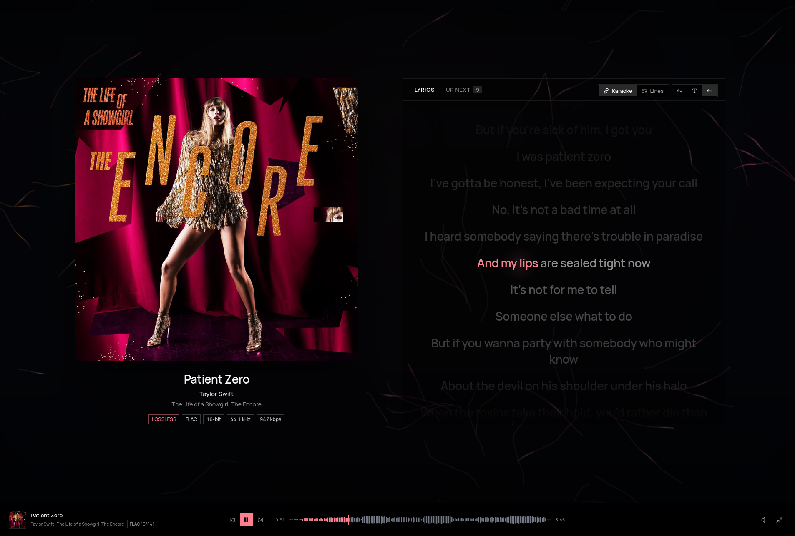
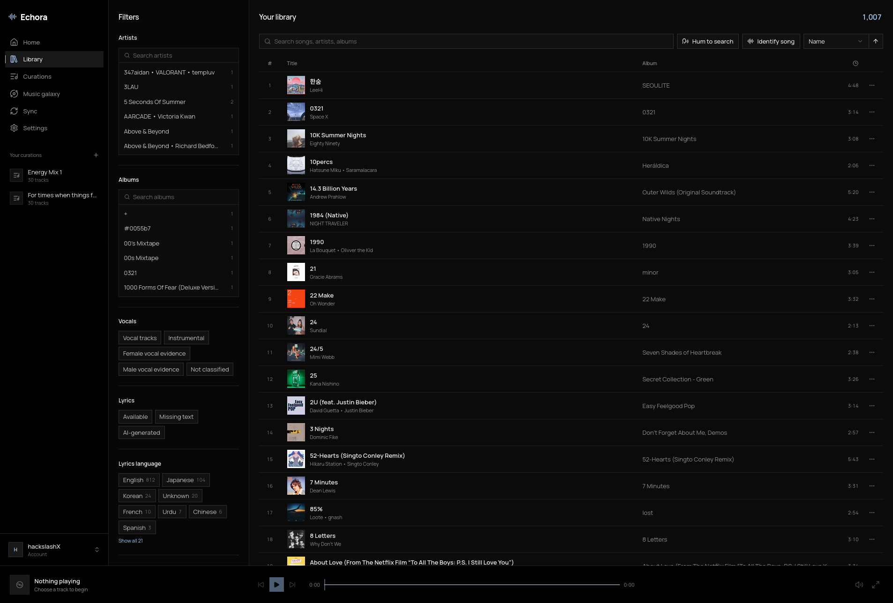
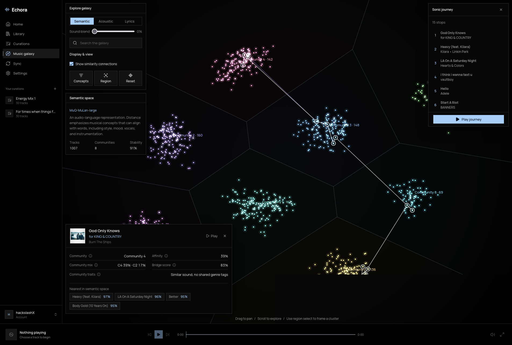
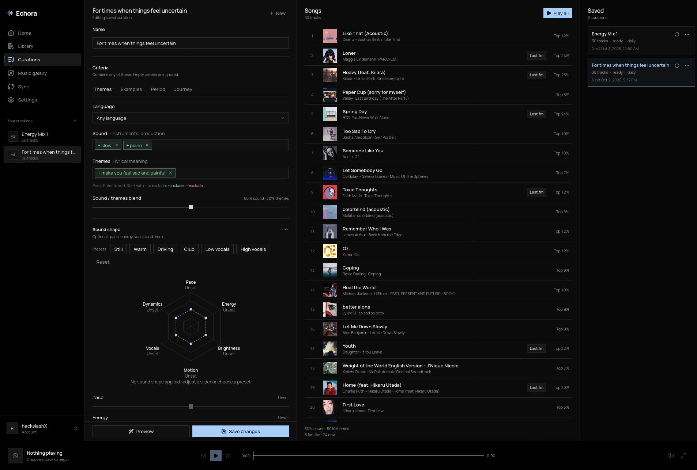
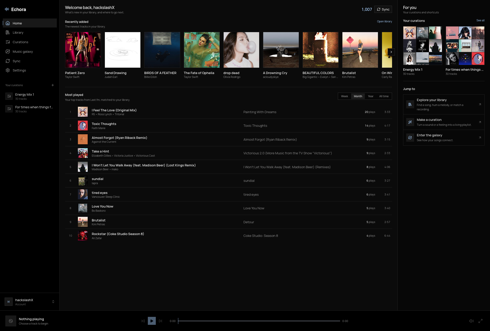
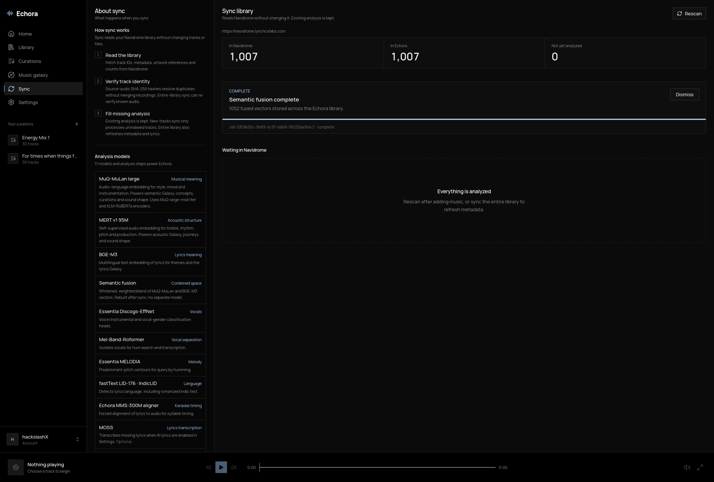

<p align="center">
  <picture>
    <source media="(prefers-color-scheme: dark)" srcset="docs/assets/echora-logo-dark.svg">
    
  </picture>
</p>

<p align="center">
  <strong>A listening companion for the music you keep on your own server.</strong>
</p>

<p align="center">
  <a href="LICENSE"></a>
  
  
</p>

<p align="center">
  
</p>

Echora connects to a [Navidrome](https://www.navidrome.org/) server and studies every track in it: how it sounds, what its lyrics say and how it relates to everything else you own. It turns that analysis into ways of listening that a plain file browser can't offer: word-timed karaoke, a map of your collection, playlists described in plain language, and search by humming.

Navidrome keeps hosting and streaming your files. Echora never modifies them, and it doesn't come with a catalog or a recommendation service. Everything it suggests comes from your own library.

**Contents:** [Features](#features) · [How processing works](#how-processing-works) · [Requirements](#requirements) · [Installation](#installation) · [Running it day to day](#running-it-day-to-day) · [Development](#development) · [Contributing](#contributing) · [License](#license) · [Acknowledgements](#acknowledgements)

---

## Features

### A player built around lyrics

- **Karaoke timing.** When a song has synced lyrics, Echora times every syllable with its own forced-alignment model, trained on singing in several languages, and highlights the words as they are sung.
- **Lyrics for songs that have none.** For vocal tracks without lyrics, an optional transcription model listens to the isolated vocals and writes them out.
- **Translations.** Connect any OpenAI-compatible model and Echora translates lyrics line by line, keeping each line paired with its timing.
- **Things to watch.** Pick from several audio-reactive visualizers, a waveform of the whole track and an optional melody line. On a capable GPU, Echora can also render a short looping animation from each album cover ([motion artwork](docs/motion-artwork.md)).
- Playback carries on while you browse. The queue, the mini player and the full-screen view stay in sync across pages.

### Find something without knowing its name



- **Filters that understand the audio.** Narrow the library by artist and album, and also by whether a track has vocals, whether lyrics exist (and whether AI wrote them), and which language they are in.
- **Hum to search.** Hum or sing a few seconds of a melody, and Echora compares its pitch contour with the melodies it extracted from your tracks.
- **Identify song.** Let your microphone hear a song that's playing nearby, and Echora finds that recording in your library. This feature is opt-in and off by default.

### See your collection as a galaxy



The galaxy draws every track as a star, close to the tracks it resembles. Switch between three kinds of resemblance:

| View | Based on |
| --- | --- |
| **Semantic** | Musical meaning: style, mood, vocals and instrumentation |
| **Acoustic** | The recorded sound itself: timbre, rhythm and production |
| **Lyrics** | What the songs are about |

Tracks gather into communities, which you can inspect along with the concepts that describe them. Pick two songs to get a **sonic journey**: a playable path that moves gradually from one to the other. The picture is only a projection for browsing. Rankings and journeys use the full underlying vectors, not distances on the screen.

### Describe the playlist you want



A **curation** is a saved recipe for a playlist. Write down sounds (`+piano`, `-synths`), lyrical themes ("make you feel sad and painful"), a language, example songs, a time period or a journey. Optionally shape the sound with sliders for pace, energy, brightness, motion, vocal presence and dynamics. Preview the result, then save it. Echora publishes the result as a playlist in Navidrome and can rebuild it on a schedule.

Curations replace their playlist's contents each time they refresh, so edit the recipe rather than the playlist. If you connect **Last.fm**, curations can balance songs you play often against ones you haven't heard in a while, and can follow when in the day you tend to listen.

### Start from what you already play



The home page brings together recent additions, your most-played tracks from Last.fm, your saved curations and shortcuts into the rest of the app.

### Works with the rest of your setup

- **Navidrome plugin.** The [Echora plugin](plugins/navidrome/README.md) brings sonic similarity, artist radio and Echora's timed and translated lyrics to Navidrome's own apps and clients, through per-account API keys.
- **Several users.** People sign in through your OpenID Connect provider and each connects their own library. A track that two people own is analyzed once and shared.
- **Administration.** Administrators approve or block accounts, choose which models run, and configure Last.fm, the external AI endpoint and the integrations from **Settings**.

---

## How processing works



Everything starts with a **sync**: Echora reads your Navidrome catalog and analyzes any track that it hasn't seen or whose analysis is out of date.

1. **Identity.** Each file is identified by a hash of its bytes, so a renamed or moved file is recognized. Echora uses Chromaprint fingerprints to notice when different files hold the same recording, and links them without deleting either.
2. **Preparation.** The audio is decoded once per purpose. A vocal separator splits off the singing, which several later steps share.
3. **Analysis.** A set of models, listed below, each record one aspect of the track.
4. **Indexing.** Vectors are stored in PostgreSQL with pgvector. The galaxy, search, curations and the plugin all read from there.

Work runs in durable background batches. A failed track doesn't block the others, finished results are kept and reused, and a sync can be cancelled or retried. Every result records the exact model revision that produced it.

| Model | What Echora uses it for |
| --- | --- |
| [MuQ-MuLan](https://github.com/tencent-ailab/MuQ) | Musical meaning, and matching music to descriptions (semantic galaxy, sound tags) |
| [MERT](https://huggingface.co/m-a-p/MERT-v1-95M) | Acoustic structure: timbre, rhythm, pitch and production (acoustic galaxy, journeys) |
| [BGE-M3](https://huggingface.co/BAAI/bge-m3) | Meaning of lyrics, in many languages (lyrics galaxy, themes) |
| Semantic fusion | A weighted blend of the MuQ-MuLan and BGE-M3 spaces |
| [Essentia](https://essentia.upf.edu/) Discogs-EffNet | Vocal presence and vocal character |
| [Mel-Band RoFormer](https://github.com/KimberleyJensen/Mel-Band-Roformer-Vocal-Model) | Separating vocals from accompaniment |
| Essentia MELODIA | Melody contours for hum search and the melody line |
| [fastText LID-176](https://fasttext.cc/docs/en/language-identification.html) · [IndicLID](https://github.com/AI4Bharat/IndicLID) | Lyrics language, including romanized Indic text |
| [Echora MMS-300M aligner](https://huggingface.co/hcX02/echora-mms-300m-multilingual-lyrics-forced-aligner) | Syllable timing for karaoke |
| [Echora MOSS transcriber](https://huggingface.co/hcX02/echora-moss-0.9b-multilingual-lyrics-transcriber) | Writing lyrics for vocal tracks that have none (optional) |
| [NMFP](https://github.com/raraz15/neural-music-fp) recording encoder | Identify song (opt-in) |
| [LTX-2.5](https://huggingface.co/Lightricks/LTX-2.5) via ComfyUI | Motion artwork (optional, needs a 24 GB GPU) |

Model files are downloaded once, at pinned revisions, into a local cache. The running service then works offline from that cache, so an upstream update can never change your results without you choosing a new revision.

Analysis is an informed estimate, not ground truth. Separation can leave instruments in the vocals, a melody tracker can follow the wrong line, and lyrics can belong to a different version of a song. When a step fails or doesn't apply, Echora leaves that feature out for the track and still plays it normally.

For details, see [architecture](docs/architecture.md), [ranking correctness](docs/analysis-correctness.md), [audio profiles](docs/audio-profiles.md), [audio descriptors](docs/audio-descriptors.md), [audio preprocessing](docs/audio-preprocessing.md), [lyric transcription](docs/song-transcription.md), [recording search](docs/recording-search.md) and [background jobs](docs/jobs.md).

---

## Requirements

**To run Echora:**

| Need | Details |
| --- | --- |
| Docker | Docker Engine with the Compose plugin |
| NVIDIA GPU | With current drivers and the NVIDIA Container Toolkit. The analysis image is built on CUDA 13.0. |
| Navidrome | A server that the analysis container can reach, and an account for its Subsonic API |
| OpenID Connect provider | Echora has no password login of its own. Any standard provider works (Authentik, Keycloak, Authelia, Google and others). It must return an email claim. |
| Disk space | Tens of gigabytes for container images and model files, plus the database and analysis data, which grow with your library. Motion artwork needs about 44 GB more. |

How much GPU you need depends on your library and which steps you enable. There isn't a measured minimum yet. The first sync of a large library is the heaviest part, especially vocal separation, melody extraction and karaoke alignment. Administrators can switch karaoke and hum processing off under **Settings → Models**. Motion artwork is the one feature with a firm requirement: a full 24 GB card.

**Optional services:**

- A **Last.fm** account, for listening history in the home page and in curations.
- An **OpenAI-compatible endpoint**, local or hosted, for lyric translation and motion-artwork prompts.
- A **Hugging Face token** with access to the gated LTX-2.5 repository, if you want motion artwork.

The Compose file also defines a CPU-only analysis service under the `cpu` profile. The web service talks to the GPU service by default, so running without a GPU means changing the Compose configuration yourself.

---

## Installation

These steps run Echora on one machine with the supplied Compose file.

**1. Get the code and create your settings file.**

```sh
git clone https://github.com/hackslashX/echora.git
cd echora
cp configs/env.example .env
```

**2. Fill in the secrets.** In `.env`, pick a database password and use it in both `POSTGRES_PASSWORD` and `DATABASE_URL`. Percent-encode any character in it that has a meaning inside a URL. Then generate the two keys:

```sh
# Session signing secret → OIDC_SESSION_SECRET
openssl rand -base64 32

# Encryption key for stored credentials → CREDENTIAL_ENCRYPTION_KEY
python3 -c 'import base64, secrets; print(base64.urlsafe_b64encode(secrets.token_bytes(32)).decode())'
```

Store `CREDENTIAL_ENCRYPTION_KEY` somewhere safe. Saved Navidrome and Last.fm credentials can't be decrypted without it, and generating a new one doesn't convert the old ones. Keep `.env` out of version control.

**3. Register Echora with your sign-in provider.** Create a client in your OIDC provider with this redirect URL (adjust the host later if you serve Echora elsewhere):

```text
http://localhost:3000/analysis/auth/oidc/callback
```

Then complete these entries in `.env`:

| Setting | Value |
| --- | --- |
| `OIDC_ISSUER_URL` | The issuer URL your provider publishes |
| `OIDC_CLIENT_ID` / `OIDC_CLIENT_SECRET` | The client you just created |
| `OIDC_REDIRECT_URI` | The redirect URL above |
| `OIDC_POST_LOGIN_REDIRECT` | `http://localhost:3000/home` |
| `OIDC_BOOTSTRAP_ADMIN_EMAIL` | The email address that becomes the first administrator |

Set `OIDC_REQUIRE_VERIFIED_EMAIL=true` if your provider verifies addresses and you want Echora to insist on it.

**4. Download the models.** This step needs internet access and is the slowest one.

```sh
docker compose build analysis
docker compose run --rm --no-deps -e HF_HUB_OFFLINE=0 analysis \
  python -m echora_analysis.download_models
```

Run it again whenever an update changes the pinned models. To add motion artwork's models, follow [its guide](docs/motion-artwork.md).

**5. Start everything.**

```sh
docker compose up -d --build
```

The database schema is created and upgraded automatically when the analysis service starts. Check that everything is healthy:

```sh
docker compose ps
curl http://localhost:3000/api/health
```

**6. Sign in and connect your music.** Open <http://localhost:3000>, sign in as the administrator, and enter your Navidrome address and account. That address is contacted **from inside the analysis container**, so `localhost` there means the container, not your computer. For a Navidrome running on the same machine, use `http://host.docker.internal:4533`. Choose a first batch of songs and let it finish before syncing everything. A small batch is a quick way to confirm the setup works.

Optional settings and their defaults are listed in [runtime settings](docs/runtime-settings.md).

---

## Running it day to day

- **Adding music.** Add files to Navidrome as usual, then run a sync from Echora's **Sync** page. *New tracks only* analyzes what's missing. *Entire library* also refreshes metadata and removes songs you no longer have.
- **What to back up.** Back up the PostgreSQL volume (`postgres-data`) and your `.env`. Model files under `data/models/` can always be downloaded again but are large, so keeping them saves time. `docker compose down` keeps your data, but `docker compose down -v` **deletes the database**.
- **Serving it beyond your machine.** The Compose file is meant for local use. It also exposes PostgreSQL and the analysis API. Before opening Echora to a network, close those ports, put the web service behind HTTPS, update the OIDC URLs and set `COOKIE_SECURE=true`. Run a single analysis replica.
- **What still uses the network.** The running service never downloads models, but it still talks to your sign-in provider, Navidrome, lyrics sources and, if configured, Last.fm and your AI endpoint.

---

## Development

The web app is Next.js and React (in `apps/web`). The analysis service is Python 3.12 and FastAPI (in `services/analysis`). They share a PostgreSQL 17 database with pgvector. The Navidrome plugin is in Go (in `plugins/navidrome`).

You need Node.js 22 or later for the web app. To work on the web app against a running backend:

```sh
npm install
docker compose stop web   # frees port 3000
npm run dev
```

The development server proxies analysis requests to `http://localhost:8000`.

Formatting runs as a pre-commit hook, with Prettier for TypeScript and Ruff for Python. Set it up once per clone:

```sh
npm ci
uv tool install pre-commit==4.6.2
pre-commit install
```

If the hook reformats a file, the commit stops. Stage the formatting changes and commit again.

| Task | Command |
| --- | --- |
| Web tests, type check, lint, build | `npm run test:web` · `npm run typecheck` · `npm run lint` · `npm run build` |
| Python tests | `PYTHONPATH=services/analysis/src pytest services/analysis/tests` (with the analysis dependencies and pytest installed) |
| Rebuild one container | `npm run rebuild:web` · `npm run rebuild:analysis` |

Tests that need a database read `TEST_DATABASE_URL`. Point it at a throwaway, migrated database, never at your real one.

Useful background: [CONTEXT.md](CONTEXT.md) defines the domain terms, and the [architecture decision records](docs/adr/) explain the major design choices.

---

## Contributing

Contributions are welcome, from bug reports to new features.

- **Open an issue first** for anything larger than a small fix, so the approach can be agreed before you write the code.
- **Keep pull requests focused.** One change per pull request, with tests that cover it and a description of how you verified it.
- **Run the checks** in [Development](#development) before you push, and keep the formatting hook installed.
- **Don't commit music, lyrics, artwork or model weights.** Screenshots must not show anything you can't share.
- **Report security problems privately,** as described in [SECURITY.md](SECURITY.md), and not in a public issue.

By submitting a contribution, you agree that it is licensed under the same AGPL-3.0 license as the project.

---

## License

Echora's source code is released under the **[GNU Affero General Public License v3.0](LICENSE)**. If you run a modified version as a service for other people, the AGPL requires you to offer them your modified source.

The models are separate works with their own licenses, and several restrict commercial use. For example, the MuQ-MuLan weights are licensed CC BY-NC 4.0, and the Essentia models are free for non-commercial use only unless licensed separately. Read the license of every model you enable before using Echora commercially.

Echora includes no music, lyrics or artwork. Those in the screenshots are shown to illustrate the interface and belong to their rights holders.

---

## Acknowledgements

Echora is built on the work of many people. Thank you to:

- **[Navidrome](https://www.navidrome.org/)**, which hosts and streams the music Echora works with.
- The model authors: Tencent AI Lab for **MuQ-MuLan**, the Multimodal Art Projection team for **MERT**, BAAI for **BGE-M3**, the Music Technology Group at Universitat Pompeu Fabra for **Essentia** and its models, Meta for **fastText** language identification and **MMS**, AI4Bharat for **IndicLID**, OpenMOSS for **MOSS-Transcribe-Diarize**, Lightricks for **LTX-2.5** and Google for **Gemma**.
- **[FA-Kara](https://github.com/moriwx/FA-Kara)** by moriwx, the karaoke alignment pipeline Echora's aligner extends, and **NextFire**'s MMS karaoke forced aligner, which the Echora aligner was fine-tuned from.
- Kimberley Jensen's **[Mel-Band RoFormer vocal model](https://github.com/KimberleyJensen/Mel-Band-Roformer-Vocal-Model)**, and the **[neural-music-fp](https://github.com/raraz15/neural-music-fp)** fingerprinting model.
- **[AudioMuse-AI](https://github.com/NeptuneHub/AudioMuse-AI)**, whose recording search and Navidrome integration informed Echora's own.
- **[Chromaprint](https://acoustid.org/chromaprint)**, **[pgvector](https://github.com/pgvector/pgvector)**, **[ComfyUI](https://github.com/comfyanonymous/ComfyUI)**, **[Three.js](https://threejs.org/)** and **[Lucide](https://lucide.dev/)**, whose icon is part of the Echora logo.
- **[Void Visualizer](https://github.com/epxweb/void-visualizer)** by epxstudio (GPL), which inspired several backdrop and visualizer designs, and Mart's PS3-style XMB backdrop (MIT).
